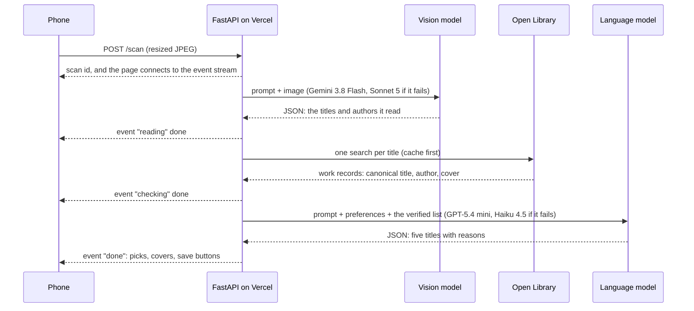
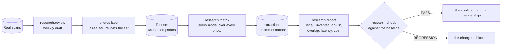

# ShelfScanner 📚

**Never leave a bookstore empty-handed again!**

Have you ever been at a book sale, library, or friend's house looking at shelves of books but didn't recognize any titles or authors? ShelfScanner solves the problem of figuring out what to read by using AI to help you discover what you'll enjoy.

[ShelfScanner.io](https://shelfscanner.io)

## What It Does

📸 **Scan Shelves** → Take a photo of an entire bookshelf  
🤖 **AI Analysis** → Get book recommendations based on your reading preferences  
📖 **Real Books Only** → Every title is checked against Open Library before it can be recommended  
💬 **Match Reasoning** → See exactly why each book is a fit for you, written to you  
📚 **Build Lists** → Save interesting books to your reading list  

## Key Features

### Smart Book Discovery
- **Shelf Scanning**: Photograph entire bookshelves to identify multiple books at once
- **AI Recommendations**: Personalized suggestions based on your Goodreads data and preferences
- **Match Reasoning**: Understand exactly why each book is recommended for you
- **Verified Titles**: Every book is matched to a real Open Library record, with its cover and author

### User Experience
- **Mobile-First Design**: Optimized for smartphones and tablets
- **Device-Based Sessions**: No account required, preferences stored per device
- **Responsive Design**: Works well on all screen sizes, with a light and a dark mode

### Performance & Reliability
- **Lookup Caching**: Repeated titles resolve from a cache in about 0.3 s instead of 4.5 s
- **Rate Limiting**: Built-in protection against API abuse, per device and per day
- **Error Handling**: Graceful fallbacks when a model provider is unavailable
- **Monitoring**: A dashboard of scans, cost, latency, errors, and failovers, plus a weekly review

## Under the hood

The rest of this README is the technical story: how it works, the decisions and the numbers behind them, how I evaluate it, and how to run it yourself.

- [How it works](#how-it-works)
- [The decisions, and the numbers behind them](#the-decisions-and-the-numbers-behind-them)
- [How I evaluate it](#how-i-evaluate-it)
- [Monitoring and the weekly loop](#monitoring-and-the-weekly-loop)
- [Numbers at a glance](#numbers-at-a-glance)
- [Running it yourself](#running-it-yourself)
- [Deployment](#deployment)
- [Repository layout](#repository-layout)
- [Questions people ask me about this](#questions-people-ask-me-about-this)
- [About this rebuild](#about-this-rebuild)

## How it works

The goal is one photo and, in about fifteen seconds, five books that are really on that shelf, each with a reason that names something true about your taste. The one number I care about is whether you save at least one book per scan.

Five boxes. The first four are one pipeline that runs both from the command line and as the stages of a web scan, and the fifth one lives in the web app.


Every stage writes a row before it returns, and every row joins back to the photo and the device session. So any pick on any screen can be traced to the exact model, prompt version, preferences, tokens, cost, and latency that produced it. That one design choice is what makes everything in the evaluation and monitoring sections possible.

Here's what one scan looks like from the browser's point of view:



The pieces:

- **The web app** is FastAPI with Jinja templates, htmx, and server-sent events for the stage-by-stage progress. No JavaScript framework. One small script resizes the photo, runs the menu and the dark mode toggle, and handles the author chips. That's it.
- **The pipeline** (`src/shelfscanner/`) is plain Python modules: one strips metadata and resizes, two run the model stages and log them, two resolve titles against Open Library, one builds the preferences object from a form or a Goodreads CSV, and one is the fuzzy title matcher every check uses.
- **The router** is a small one I wrote myself. Pipeline code never imports a provider SDK. A config file says which model serves each stage and what its fallback is, and one adapter per provider (Google, OpenAI, Anthropic, OpenRouter) turns every call into the same result shape: raw text, parsed JSON, tokens, reasoning tokens, cost, latency, finish reason, the provider's request id, and any error.
- **Storage** is Supabase. A private bucket for photos and Postgres for everything else, with row-level security on and zero policies, so only the service key on the server can read anything.
- **Identity** is a cookie holding a random token, and the database only keeps its hash. No accounts, no PII.

## The decisions, and the numbers behind them

Every one of these was decided by a measurement, and the measurement is written down in `docs/changes/`. Here's the short version of each.

**Two stages, two models, chosen separately.** The models that read shelves without making up titles (Gemini 3.8 Flash, Sonnet 5) are slow and no better at choosing. The fast cheap one (GPT-5.4 mini) chooses best but invents about 2.6 titles per photo when you ask it to read. So I split the job and let each stage use the model that's good at it.

**Invented titles are a model property, not a prompt property.** Same prompt, five shelves: two models invented nothing, three others invented anywhere from 1.4 to 6.8 titles per photo. That means model choice is the first line of defense, and the Open Library check is the second. And the check earns its keep. On a blurry photo, which is the failure you should expect at a real shelf, even the best model merged neighboring spines into things like "The Book of This and That You Lose the Time." None of those resolve to a real record, so they get dropped.

**Verification, not enrichment.** The lookup step drops a title the catalogue can't find rather than decorating one it can. The cost is real: about one real book in seven gets dropped, mostly self-published stuff and German Fraktur spines Open Library doesn't have. I took that trade, because recommending a book that doesn't exist is the worse failure by a lot.

**Your preferences, not the model, are what limits quality.** Where the best chooser missed my own picks, the reason was always taste my preferences file didn't describe. So I built the Goodreads import before I even considered a stronger model, and overlap with my own picks went from a mean of about 2.3 to 3.3 out of 5 on the same model. Better input beat a bigger model.

**A router of my own, not a framework.** The models that pass today didn't exist eighteen months ago, and the ones that fail were last year's best. Honestly, the comparison was only cheap because every model was a config entry behind one interface. Swapping a model is a config edit plus one command that reruns the test set.

**Failover, not retries.** Each stage has a fallback that passed the same test. On a provider error, a timeout, or a truncated reply, the router fails over once and logs which model answered and why. This has already saved me twice. Gemini's free tier rate-limited every read for a day and Sonnet answered all of them, and no scan failed. And the original choosing fallback was on a shared pool that kept returning 429s, which the first weekly review caught, so I swapped it.

**Reasoning budgets are a real failure mode.** Qwen 3.8 Flash at its default reasoning effort spent the entire reply budget thinking on three of five photos and never wrote the JSON. Every call now carries an explicit output cap and a per-model reasoning setting, and a truncated reply is logged as its own error, separate from a parse failure.

**Latency is the binding constraint, not cost.** A scan costs about a cent. But the two model calls take 13 to 15 seconds at the median, mostly reasoning tokens, and the lookup step added another 4.5 seconds until I built a cache that brings a repeated shelf down to about 0.3 seconds. I'd written the rule in advance: build the cache if lookups add more than 3 seconds. They did. And the progress shows stage by stage instead of a spinner, because fifteen seconds of nothing feels broken.

**Prompts are files, versioned by filename, logged on every row.** There are six versions of the recommendation prompt. Each one got scored against the last one on the same shelves before it became the default, and one of them (v4) lost on-list share and got kept only as a comparison row. More on this below.

**No RAG, no agents, no fine-tuning.** The lookup is a keyed search, not retrieval over chunks. The pipeline is a fixed sequence of two calls with one lookup between them, and there's nothing to decide at runtime that a tool-calling loop would decide better. Every extra round trip costs seconds in a system where seconds are the problem. And a fine-tune would be tuned to a model that gets replaced before it pays back.

**Server-rendered pages with htmx.** You're standing at a shelf holding a phone. The page is small, there's no build step, and the event stream gives you stage-by-stage progress without a client framework.

**Specs in files, not in chat.** I built this with an AI coding agent working under a written process: no code without an approved proposal, one spec file per capability that has to stay true, and every decision recorded next to the number that made it. The rulebook is in the repo root and the roadmap is `docs/changes/README.md`.

## How I evaluate it

Evaluation is the part of this project I'm most proud of, so hear me out.



**The test set.** 64 photos. Five core shelves I photographed myself, with 69 hand-labeled titles and my own five picks per shelf. Twenty degraded copies of those (blur, glare, rotation, a smaller image) so I can measure what conditions do on shelves whose labels I already trust. And 39 openly licensed shelf photos from Wikimedia Commons with about 1,700 labeled titles (attribution in `data/labels/SOURCES.md`). Labels are JSON files in the repo. The photos never are.

**The metrics.** For reading: recall against the labels, missed titles, and invented titles, and those last two are counted separately because inventing is the worse failure. Matching is a normalized fuzzy comparison at 0.85. For choosing: the share of picks that are on the list the model was given (has to be 100%), the share that are real books, and overlap with my own picks for that shelf. That overlap number is the quality measure. No LLM-as-judge. The set is small enough to read, and I'm a better judge of my own taste than a model is.

**What the model matrix found** (change 001, five shelves, five models):

| Reading | Recall | Invented / photo | Cost / photo | p50 |
|---|---|---|---|---|
| Gemini 3.8 Flash | 1.00 | 0.0 | $0.008 | 11.6 s |
| Claude Sonnet 5 | 1.00 | 0.0 | $0.015 | 10.0 s |
| Qwen 3.8 Flash, reasoning off | 0.89 | 1.4 | $0.0004 | 6.1 s |
| GPT-5.4 mini | 0.78 | 2.6 | $0.0025 | 2.3 s |
| Claude Haiku 4.5 | 0.42 | 6.8 | $0.0035 | 4.6 s |

| Choosing | On the list | Overlap with my picks, median | Cost / run | p50 |
|---|---|---|---|---|
| GPT-5.4 mini | 25 / 25 | 4 of 5 | $0.002 | 3.2 s |
| Gemini 3.8 Flash | 25 / 25 | 3 | $0.008 | 11.5 s |
| Qwen 3.8 Flash | 25 / 25 | 3 | $0.0003 | 4.8 s |
| Claude Haiku 4.5 | 25 / 25 | 3 | $0.0025 | 4.2 s |
| Claude Sonnet 5 | 25 / 25 | 2 | $0.013 | 11.8 s |

**The prompt versions**, same model, same shelves (`research.report --by-prompt`):

| Prompt | What changed | On-list | Overlap, mean |
|---|---|---|---|
| v1 | the MVP prompt | 1.00 | 3.0 |
| v2 | takes the Goodreads rated books | 1.00 | 3.2 (3.6 with the export) |
| v3 | preferences first, shelf last, headed "the only books you may recommend" | 1.00 | 3.4 |
| v4 | favorite authors "and books that resemble their work" | 0.96 | 3.4, and off-shelf picks in 2 of 15 runs |
| v5 | favorite authors, one line | 1.00 | 3.4 |
| v6 | reasons written to you, in the second person | 1.00 | 3.2 |

v3 exists because of a real failure. With a Goodreads-sized preferences block sitting after the shelf list, GPT-5.4 mini recommended books that weren't on the shelf on three of five photos. Moving the shelf to the end, right next to the reply, fixed it. Prompt layout matters more than I expected.

**The gate.** There's a baseline file with the accepted numbers. One command measures the models named as primary in config on the same photos and fails on any regression in recall, invented titles, on-list share, or overlap, with a 10% tolerance on latency and cost. It runs nightly in GitHub Actions with a spend cap and fails the workflow on a regression. And it's the acceptance test for any model, prompt, or adapter change. No exceptions.

**Growing the set from real failures.** When a real scan goes wrong in an interesting way, one command copies it into the labeled set with the titles you give it, so the next eval covers the shelf that just broke.

## Monitoring and the weekly loop

- **Every request is a row.** Model, prompt version, provider, request id, tokens, reasoning tokens, cost, latency, finish reason, raw reply, error, and whether a fallback answered. Rows never get deleted. A rerun adds one.
- **Feedback.** "Save for Later" and "Not for me" each write a row keyed on the recommendation and the pick, so feedback joins straight to the prompt version and preferences that produced it.
- **A dashboard** at `/admin`, behind a shared secret. Scans per day, completion rate, save rate, not-for-me rate, p50 and p95 latency per stage, cost per scan, spend, error rate split into model failures and application failures, failovers, lookup and cache hit rates. Real scans and the test set side by side, never mixed. Seven-day, thirty-day, and all-time windows.
- **Guards instead of pages.** A per-device limit on scans per hour and a daily spend cap for the whole app both refuse a scan with a message that says the actual number. Photos get deleted after thirty days by a daily job.
- **The weekly review.** Every Monday a workflow drafts a review from the rows: failures by stage, model, and cause, every failover with the primary's error, and every "not for me" with the reason the model gave. Then a coding agent sorts each group into model failure, application failure, or noise under a written brief, and opens a pull request. It changes no code. A repeated pattern becomes a proposal I approve. The first review is what moved the choosing fallback off that rate-limited pool.

## Numbers at a glance

| | Value | Where it's measured |
|---|---|---|
| Reading recall, my five shelves | 1.00, zero invented | `001-mvp/results.md` |
| Reading recall, blurred copies | 0.83, 0.2 invented / photo | `006-test-set/results.md` |
| Picks on the shelf | 100% on every run since v3 | `report --by-prompt` |
| Overlap with my own picks | 3.2 to 3.4 of 5, mean | `report --by-prompt` |
| Titles the lookup resolves | 85% | `007-book-lookup/results.md` |
| Lookup latency, cold / cached | 4.5 s / 0.3 s p50 | `008-hardening/results.md` |
| Model latency, reading + choosing | 13 to 15 s p50 | `001`, `research.check` |
| Cost per scan | about a cent | `research.check` |
| Test set | 64 photos, 1,700+ labeled titles | `data/labels/` |
| Tests | 400+ (pytest and Playwright), on every push | `.github/workflows/ci.yml` |

## Running it yourself

### Without any keys, in about two minutes

The app can run on an in-memory fake pipeline: no database, no provider, and every scan returns the same fixed titles and picks. It's enough to click through every page and run the browser tests.

```
git clone https://github.com/MarinaWyss/ShelfScanner.git
cd ShelfScanner
uv sync                                   # Python 3.12+, https://docs.astral.sh/uv/
SHELFSCANNER_FAKE_PIPELINE=1 uv run uvicorn shelfscanner.web.app:app --port 8000
```

Open http://localhost:8000. To run the tests:

```
uv run playwright install chromium       # once, for the browser tests
uv run pytest -q                          # the whole suite; add --ignore=tests/e2e for the fast half
uv run ruff check .
```

### With real models

You'll need a [Supabase](https://supabase.com) project (the free tier is fine), the [Supabase CLI](https://supabase.com/docs/guides/cli), and at least one provider key. The defaults in `config/models.toml` use Google for reading, OpenAI for choosing, and Anthropic for both fallbacks. Any model whose key is missing just fails over to the other one.

```
cp .env.example .env
```

Fill in `SUPABASE_URL` and `SUPABASE_SECRET_KEY` (Project Settings → API in the Supabase dashboard; the secret key, not the anon key), then whichever of `GEMINI_API_KEY`, `OPENAI_API_KEY`, and `ANTHROPIC_API_KEY` you have, and set `SHELFSCANNER_SPEND_CAP_USD` to something like `5` so no command can run away from you. Then create the tables and the private photo bucket:

```
supabase login
supabase link                             # pick your project
supabase db push --linked
```

And run the app:

```
uv run uvicorn shelfscanner.web.app:app --host 0.0.0.0 --port 8000
```

`--host 0.0.0.0` puts it on your local network, so your phone on the same Wi-Fi can open `http://<your laptop's IP>:8000` and scan a real shelf. Set `SHELFSCANNER_ADMIN_SECRET` in `.env` and open `/admin?key=<that>` for the dashboard.

### The command line

The same pipeline, one stage at a time, against photos in `data/photos/` (gitignored) with label files in `data/labels/`:

```
uv run shelfscanner photos sync                                   # strip metadata, upload, upsert labels
uv run shelfscanner photos fetch                                  # download the sourced test photos from their label files
uv run shelfscanner extract --photo all --model gemini-flash
uv run shelfscanner recommend --extraction 16 --model gpt-mini --prefs data/prefs/marina.json
uv run shelfscanner run --photo 3 --prefs data/prefs/marina.json   # extract, verify, recommend
uv run shelfscanner prefs import --csv goodreads_library_export.csv --genres Fiction Science
uv run shelfscanner photos label 145 --titles "Dune" "Piranesi"    # promote a real scan into the test set
uv run shelfscanner photos retain --dry-run                        # what the retention job would delete
```

### The research tooling

This lives outside the pipeline package, in `research/`, and runs as modules from the repo root. It's everything the evaluation section describes.

```
uv run python -m research.matrix vision gemini-flash,sonnet --set core     # every model over every photo
uv run python -m research.matrix llm gpt-mini --prompt recommend_v6 --verify
uv run python -m research.report                                           # per-model tables from the rows
uv run python -m research.report --by-prompt                               # prompt versions side by side
uv run python -m research.report --html report.html                        # the visual report
uv run python -m research.check                                            # PASS or REGRESSION against the baseline
uv run python -m research.eval --set core                                  # matrix + check in one command
uv run python -m research.review --since 2026-09-01 --stdout               # draft a weekly review
```

## Deployment

Vercel, straight from this repo, at [shelfscanner.io](https://shelfscanner.io). `index.py` at the root is the entry point the FastAPI preset finds, `vercel.json` keeps tests, docs, and data out of the function bundle, Python 3.12 comes from `.python-version`, and dependencies come from `uv.lock`. The environment variables from `.env.example` (minus the fake-pipeline, retention, and CLI-cap ones) are set in the Vercel project.

`main` is production and it's protected. Work happens on a branch, lands by pull request once CI is green, and every branch gets a preview URL. Three scheduled jobs stay in GitHub Actions: the nightly eval, the daily photo retention, and the Monday review. `docs/specs/deployment.md` has the rest, including what's different from running on a laptop.

## Repository layout

```
config/models.toml       models, which one serves each stage, fallbacks, prices, threshold, image size
prompts/                 one file per prompt version; the filename is logged on every row
data/labels/             hand labels per test photo (committed); SOURCES.md for attribution
data/photos/             the photos (gitignored)
data/prefs/              preferences files and my own picks per shelf
src/shelfscanner/        the pipeline: images, extract, verify, lookup, recommend, preferences,
                         router and adapters/, spend, retention, storage, db, config, cli
src/shelfscanner/web/    the FastAPI app: scan, prefs, picks, sessions, limits, metrics, admin,
                         templates and static files; fakes.py for the tests
research/                matrix drivers, report, check, eval, review, baseline.json
supabase/migrations/     schema, grants, constraints; RLS on, service role only
tests/                   pytest over fakes and recorded fixtures; tests/e2e drives Chromium
docs/scoping.md          the plan: problem, constraints, requirements, decision log
docs/specs/              how the system behaves today, one file per capability
docs/changes/            one folder per change: proposal, tasks, results; archive/ when done
docs/reviews/            the weekly reviews and the brief the reviewer follows
.github/workflows/       ci, nightly-eval, retention, weekly-review
```

## Questions people ask me about this

Short answers. Each one is backed by a section above or a file in `docs/`.

- **Why two models?** Reading and choosing need different things. The models that never invent a title are slow, and the fast cheap one invents 2.6 per photo but chooses the best. See the decisions section.
- **How do you know the picks are real books that are on the shelf?** Two defenses. A reading model measured at zero invented titles, then every title checked against Open Library before the chooser ever sees the list, and every pick checked against that list afterward. On-list share has been 100% on every run since prompt v3.
- **How do you evaluate a recommendation without an LLM judge?** Overlap with my own five picks for that shelf. I'm the ground truth for my own taste.
- **What happens when a provider goes down?** The router fails over once to a fallback that passed the same test, logs which model answered and why, and the dashboard counts it. Gemini's rate limit took out a full day of reads and not one scan failed.
- **What did the eval actually catch?** A prompt change (v4) that put off-shelf books into 2 of 15 runs, and a prompt layout (v2) that did it in 3 of 5. Both would've shipped without the numbers.
- **How do you keep costs bounded?** About a cent a scan, a per-device hourly limit, a daily cap for the whole app, a spend cap on every CLI command, and cost logged per call from tokens and config prices.
- **What would you do with more traffic?** Watch save rate and failovers first. Add retrieval over the preferences if people's Goodreads histories outgrow the prompt. And only look at a cheaper reading model once one stops inventing titles on a few hundred labeled photos.
- **How was it built?** Spec-driven, with an AI coding agent working under a rulebook in the repo: proposal before code, specs kept true, decisions recorded with their numbers, and `main` protected behind CI. The whole process is the YouTube series.

## About this rebuild

The first version of ShelfScanner ([a different codebase](https://github.com/MarinaWyss/ShelfScanner-v1)) was something I vibe coded in 2025, and it kinda worked, which was the problem. This is the rebuild, and it's me doing the thing properly: measured model choices, a real test set, an eval gate in CI, monitoring, and a written spec for every behavior. I'm making a YouTube series about the process, so this README is also the "how did you build that" answer for anyone who asks.

If you want to go deeper than this file: `docs/scoping.md` is the plan the project follows, `docs/specs/` is what the code actually does today, and `docs/changes/` has every proposal with the numbers that decided it.
