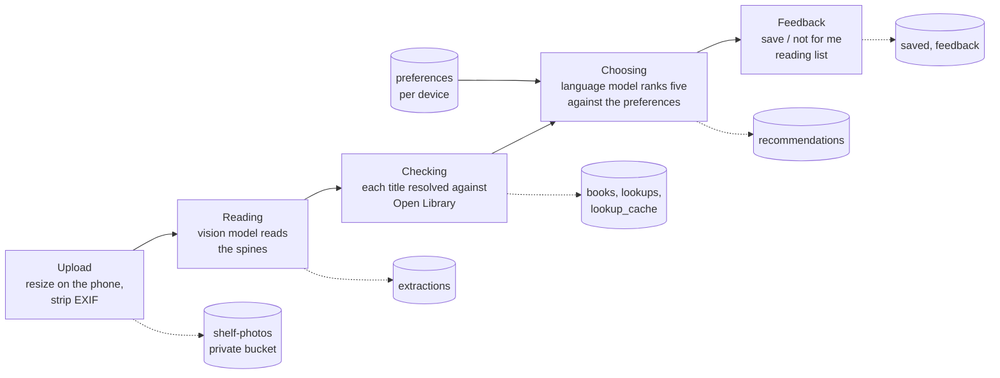
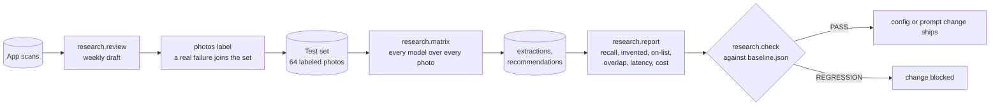

# ShelfScanner

Point a phone at a bookshelf and get five books from that shelf you would
actually like, each with a reason written to you.

Live: https://shelfscanner-nu.vercel.app. The earlier ShelfScanner
(shelfscanner.io, [a separate codebase](https://github.com/MarinaWyss/ShelfScanner-v1))
was built fast in 2025; this is the rebuild, done as an exercise in building
an LLM product properly: measured model choices, a real test set, an eval
gate in CI, monitoring, and a written spec for every behavior.

This README is the whole story. `docs/scoping.md` is the project plan it
follows, `docs/specs/` describes what the code does today, and
`docs/changes/` holds every proposal with the numbers that decided it.

- [The problem](#the-problem)
- [What it does](#what-it-does)
- [How it works](#how-it-works)
- [Key decisions and trade-offs](#key-decisions-and-trade-offs)
- [Evaluation](#evaluation)
- [Monitoring and the improvement loop](#monitoring-and-the-improvement-loop)
- [Numbers at a glance](#numbers-at-a-glance)
- [Running it](#running-it)
- [Deployment](#deployment)
- [Repository layout](#repository-layout)
- [Questions this project answers](#questions-this-project-answers)

## The problem

Standing in a bookstore, a library or a friend's living room, you can only
judge a shelf by the titles you already recognize. The moment you are most
able to pick up a book is the moment you know least about it. Google Lens
identifies one book at a time and says nothing about whether you would like
it. Goodreads and StoryGraph know your taste but cannot see the shelf.
Nothing takes "here is what is physically in front of me" as input.

The goal: one photo, and within about fifteen seconds, five books that are
really on that shelf, each with a reason that names something true about
your taste, and a way to save the ones you want. The primary success metric
is that the user saves at least one recommendation per scan.

## What it does

1. **Preferences.** Pick genres, name favorite authors, say in your own words
   what you like, and optionally upload a Goodreads export. The export is
   read once and never stored; what is kept is your rated books, your
   to-read list and the books you did not finish.
2. **Photo.** Take or choose a photo of a shelf. The phone resizes it and
   strips its metadata before anything leaves the device.
3. **Recommendations.** Watch three stages complete (reading the shelf,
   checking titles, choosing), then see five picks with covers, authors and
   a reason each. Save any for later, or mark it not for you. Your reading
   list lives on the device, no account.

## How it works

Five boxes. The first four are one pipeline that runs both as CLI commands
and as the stages of a web scan; the fifth lives in the web app.



Every stage writes a row before it returns, and every row joins back to
the photo and the device session, so any pick on any screen can be traced
to the model, prompt version, preferences, tokens, cost and latency that
produced it.

A scan, as the browser sees it:

```mermaid
sequenceDiagram
    participant Phone
    participant App as FastAPI on Vercel
    participant V as Vision model
    participant OL as Open Library
    participant T as Language model
    Phone->>App: POST /scan (resized JPEG)
    App-->>Phone: scan id; page connects to the event stream
    App->>V: prompt + image (Gemini 3.8 Flash, Sonnet 5 on failure)
    V-->>App: JSON: titles and authors read
    App-->>Phone: event "reading" done
    App->>OL: one search per title (cache first)
    OL-->>App: work records: canonical title, author, cover
    App-->>Phone: event "checking" done
    App->>T: prompt + preferences + verified list (GPT-5.4 mini, Haiku 4.5 on failure)
    T-->>App: JSON: five titles with reasons
    App-->>Phone: event "done": picks, covers, save controls
```

The pieces:

- **Web app**: FastAPI, Jinja templates, htmx and server-sent events for
  the stage-by-stage progress. No JavaScript framework; one small script
  resizes the photo, runs the drawer and the theme toggle, and
  handles the author chips.
- **Pipeline** (`src/shelfscanner/`): `images` strips metadata and resizes;
  `extract` and `recommend` run the two model stages and log them;
  `lookup` and `verify` resolve titles against Open Library; `preferences`
  builds the preferences object from a form or a Goodreads CSV;
  `matching` is the fuzzy title matcher every check uses.
- **Router** (`router.py`, `adapters/`): a small router of our own. Pipeline
  code never imports a provider SDK. `config/models.toml` names which model
  serves each stage and its fallback; one adapter per provider (Google,
  OpenAI, Anthropic, OpenRouter) turns a call into the same result shape:
  raw text, parsed JSON, tokens, reasoning tokens, cost, latency, finish
  reason, provider request id, error.
- **Storage**: Supabase. A private bucket for photos and Postgres for
  everything else, with row-level security on and no policies, so only the
  service key the server holds can read anything.
- **Identity**: a device cookie holding a random token; the database keeps
  only its hash. No accounts, no PII.

## Key decisions and trade-offs

Each of these was decided by a measurement recorded in `docs/changes/`.
The one-line version, with where to read more.

**Two stages, chosen separately.** The models that read shelves without
inventing titles (Gemini 3.8 Flash, Sonnet 5) are slow and no better at
choosing; the models that choose well (GPT-5.4 mini) invent 2.6 titles per
photo when asked to read. Splitting the job lets each stage use the model
that is good at it. (`001-mvp/results.md`)

**Invented titles are a model property, not a prompt property.** On the same
prompt, two models invented nothing across five shelves and three others
invented 1.4 to 6.8 titles per photo. Model choice is the first defense;
the Open Library check is the second. The check exists because a blurry
photo, the failure to expect at a real shelf, produced merged spines like
"The Book of This and That You Lose the Time" even from the best model, and
none of those resolve to a record. (`001`, `006`, `007`)

**Verification, not enrichment.** The lookup step drops a title the
catalogue cannot find rather than decorating one it can. Measured cost:
about one real book in seven is dropped (self-published titles, German
Fraktur spines Open Library does not have). Accepted, because a pick that
is not a real book is the worse failure. (`007-book-lookup/results.md`)

**Preferences, not the model, limit recommendation quality.** Where the best
chooser missed the user's own picks, the cause was taste the preferences
file did not describe. So change 004 built the Goodreads import before
anyone considered a stronger model: overlap with the user's picks went from
a mean of 2.25 to 3.25 out of 5 on the same model. (`004-preferences`)

**A router of our own, not a framework.** The models that pass today did not
exist eighteen months ago, and the ones that fail were last year's best.
The comparison was cheap only because every model was a config entry
behind one interface. Swapping a model is an edit to `config/models.toml`
plus one command that reruns the test set. (`002-provider-router`)

**Failover, not retries.** Each stage has a fallback that passed the same
test. On a provider error, timeout or truncated reply the router fails over
once and logs which model answered and why. This has already paid for
itself twice: Gemini's free tier rate-limited every read for a day and
Sonnet answered them all; the original choosing fallback (Qwen on a shared
pool) returned 429s and was swapped for Haiku after the first weekly review.

**Reasoning budgets are a real failure mode.** Qwen 3.8 Flash at its default
reasoning effort spent the whole 4,096-token reply budget thinking on three
of five photos and never wrote the JSON. Every call now carries an explicit
output cap and a per-model reasoning setting; a truncated reply is logged
as its own error, distinct from a parse failure.

**Latency is the binding constraint, not cost.** A scan costs about a cent.
The two model calls take 13 to 15 s p50, mostly reasoning tokens, and the
lookup added 4.5 s until a cache brought a repeated shelf down to 0.3 s.
That number is why the cache exists: the rule written in advance was "build
it if lookups add more than 3 s". Progress is shown per stage, not as a
spinner, because fifteen seconds with nothing happening feels broken.

**Prompts are files, versioned by filename, logged on every row.** Six
versions of the recommendation prompt exist. Each change was scored against
the previous one on the same shelves before becoming the default; v4 lost
on-list share and was kept only as a comparison row. (`prompts/`, `004`,
`012`)

**No RAG, no agents, no fine-tuning.** The lookup is a keyed search, not
retrieval over chunks. The pipeline is a fixed sequence of two calls with
one lookup between them; nothing needs deciding at runtime that a
tool-calling loop would decide better, and every extra round trip costs
seconds. A fine-tune would be tuned to a model that is replaced before it
pays back. (`docs/scoping.md` sections 4, 5, 8)

**Server-rendered pages with htmx.** The user is standing at a shelf on a
phone. The page is small, works without a build step, and the event stream
gives stage-by-stage progress without a client framework.

**Specs in files, not in chat.** The project was built with an AI coding
agent under a written process: no code without an approved proposal, one
spec file per capability kept true, every decision recorded next to the
number that made it. `CLAUDE.md` is the rulebook; `docs/changes/README.md`
is the roadmap.

## Evaluation



**The test set.** 64 photos: five core shelves photographed by the author
with 69 hand-labeled titles and the author's own five picks per shelf; 20
degraded copies of those (blur, glare, rotation, 1024 px) so the effect of
conditions can be measured on shelves whose labels are confirmed; and 39
openly licensed shelf photos from Wikimedia Commons with 1,677 labeled
titles (attribution in `data/labels/SOURCES.md`). Labels are JSON files in
`data/labels/`, committed; the photos themselves are never in the repo.

**Metrics.** Reading: recall against the labels, missed, and invented,
counted separately because invention is the worse failure, matched by a
normalized fuzzy comparison at 0.85. Choosing: share of picks on the list
the model was given (must be 100%), share that are real books, and overlap
with the user's own picks for that shelf, which is the quality measure. No
LLM-as-judge: the set is small enough to read, and the user's own picks are
a better judge of the user's taste.

**What the matrix found (change 001, five shelves, all five models):**

| Reading | Recall | Invented / photo | Cost / photo | p50 |
|---|---|---|---|---|
| Gemini 3.8 Flash | 1.00 | 0.0 | $0.008 | 11.6 s |
| Claude Sonnet 5 | 1.00 | 0.0 | $0.015 | 10.0 s |
| Qwen 3.8 Flash, reasoning off | 0.89 | 1.4 | $0.0004 | 6.1 s |
| GPT-5.4 mini | 0.78 | 2.6 | $0.0025 | 2.3 s |
| Claude Haiku 4.5 | 0.42 | 6.8 | $0.0035 | 4.6 s |

| Choosing | On the list | Overlap with own picks, median | Cost / run | p50 |
|---|---|---|---|---|
| GPT-5.4 mini | 25 / 25 | 4 of 5 | $0.002 | 3.2 s |
| Gemini 3.8 Flash | 25 / 25 | 3 | $0.008 | 11.5 s |
| Qwen 3.8 Flash | 25 / 25 | 3 | $0.0003 | 4.8 s |
| Claude Haiku 4.5 | 25 / 25 | 3 | $0.0025 | 4.2 s |
| Claude Sonnet 5 | 25 / 25 | 2 | $0.013 | 11.8 s |

**Prompt versions, same model, same shelves (`research.report --by-prompt`):**

| Prompt | What changed | On-list | Overlap mean |
|---|---|---|---|
| v1 | the MVP prompt | 1.00 | 3.0 |
| v2 | takes the Goodreads rated books | 1.00 | 3.2 (3.6 with the export) |
| v3 | preferences first, shelf last, headed "the only books you may recommend" | 1.00 | 3.4 |
| v4 | favorite authors "and books that resemble their work" | 0.96 | 3.4, off-shelf picks in 2 of 15 runs |
| v5 | favorite authors, one line | 1.00 | 3.4 |
| v6 | reasons written to the reader in the second person | 1.00 | 3.2 |

v3 exists because of a real failure: with a Goodreads-sized preferences
block after the shelf list, GPT-5.4 mini recommended books that were not on
the shelf on three of five photos. Putting the shelf last, next to the
reply, fixed it.

**The gate.** `research/baseline.json` holds the accepted numbers per set.
`uv run python -m research.check` measures the models named as primary in
config on the same photos and fails on any regression in recall, invented
titles, on-list share or overlap; latency and cost get a 10% tolerance.
`research.eval` is the whole thing in one command. It runs nightly in
GitHub Actions with a spend cap and fails the workflow on a regression, and
it is the acceptance test for any model, prompt or adapter change.

**Growing the set from real failures.** `shelfscanner photos label <scan id>
--titles ...` copies a real scan into the labeled set, so the next eval
covers the shelf that just went wrong.

## Monitoring and the improvement loop

- **Every request is a row.** Model, prompt version, provider, request id,
  tokens, reasoning tokens, cost, latency, finish reason, raw reply, error,
  and any failover. Rows are never deleted; a rerun adds one.
- **Feedback.** "Save for Later" and "Not for me" each write a row keyed on
  the recommendation and pick index, so feedback joins to the prompt version
  and preferences that produced the pick.
- **Dashboard** at `/admin`, behind a shared secret: scans per day,
  completion rate, save rate, not-for-me rate, p50 and p95 latency per
  stage, cost per scan, spend, error rate split into model and application
  failures, failover count, lookup and cache hit rates. App scans and the
  test set side by side, never mixed. Seven-day, thirty-day and all-time
  windows.
- **Guards instead of pages.** A per-device limit of scans per hour and a
  daily spend cap for the whole app refuse a scan with a message that says
  the number. Photos are deleted after thirty days by a daily job.
- **The weekly review.** Every Monday a workflow drafts `docs/reviews/<date>.md`
  from the rows (failures by stage, model and cause; failovers with the
  primary's error; every not-for-me with the model's reason). A Claude Code
  agent then sorts each group into model failure, application failure or
  noise under `docs/reviews/PROMPT.md` and opens a pull request. It changes
  no code; a repeated pattern becomes a proposal. The first review moved the
  choosing fallback off a rate-limited pool.

## Numbers at a glance

| | Value | Where measured |
|---|---|---|
| Reading recall, core shelves | 1.00, zero invented | `001-mvp/results.md` |
| Reading recall, blurred copies | 0.83, 0.2 invented / photo | `006-test-set/results.md` |
| Picks on the shelf | 100% on every run since v3 | `report --by-prompt` |
| Overlap with the user's own picks | 3.2 to 3.4 of 5, mean | `report --by-prompt` |
| Titles resolved by the lookup | 85% | `007-book-lookup/results.md` |
| Lookup latency, cold / cached | 4.5 s / 0.3 s p50 | `008-hardening/results.md` |
| Model latency, reading + choosing | 13 to 15 s p50 | `001`, `research.check` |
| Cost per scan | about $0.01 | `research.check` |
| Test set | 64 photos, 1,700+ labeled titles | `data/labels/` |
| Tests | 400+ (pytest, Playwright), on every push | `.github/workflows/ci.yml` |

## Running it

### Without keys, in two minutes

The app runs on an in-memory fake pipeline: no database, no provider, every
scan returns the same fixed titles and picks. Enough to see every page and
run the browser tests.

```
git clone https://github.com/MarinaWyss/ShelfScanner.git
cd ShelfScanner
uv sync                                   # Python 3.12+, https://docs.astral.sh/uv/
SHELFSCANNER_FAKE_PIPELINE=1 uv run uvicorn shelfscanner.web.app:app --port 8000
```

Open http://localhost:8000. To run the tests:

```
uv run playwright install chromium       # once, for the browser tests
uv run pytest -q                          # the whole suite; --ignore=tests/e2e for the fast half
uv run ruff check .
```

### With real models

You need a [Supabase](https://supabase.com) project (free tier is fine),
the [Supabase CLI](https://supabase.com/docs/guides/cli), and at least one
provider key. The defaults in `config/models.toml` use Google (reading),
OpenAI (choosing), and Anthropic (both fallbacks); any model whose key is
missing simply fails over to the other.

```
cp .env.example .env
```

Fill in `SUPABASE_URL` and `SUPABASE_SECRET_KEY` (Project Settings → API in
the Supabase dashboard; the secret key, not the anon key), then
`GEMINI_API_KEY`, `OPENAI_API_KEY`, `ANTHROPIC_API_KEY` for the providers you
have, and `SHELFSCANNER_SPEND_CAP_USD` (say `5`) so no command can run away.
Then create the tables and the private photo bucket:

```
supabase login
supabase link                             # pick your project
supabase db push --linked
```

Run the app:

```
uv run uvicorn shelfscanner.web.app:app --host 0.0.0.0 --port 8000
```

`--host 0.0.0.0` puts it on your local network, so a phone on the same
Wi-Fi can open `http://<your laptop's IP>:8000` and scan a real shelf. Set
`SHELFSCANNER_ADMIN_SECRET` in `.env` and open `/admin?key=<that>` for the
dashboard.

### The command line

The same pipeline, one stage at a time, against photos in `data/photos/`
(gitignored) with label files in `data/labels/`:

```
uv run shelfscanner photos sync                                   # strip metadata, upload, upsert labels
uv run shelfscanner photos fetch                                  # download the sourced test photos from their label files
uv run shelfscanner extract --photo all --model gemini-flash
uv run shelfscanner recommend --extraction 16 --model gpt-mini --prefs data/prefs/marina.json
uv run shelfscanner run --photo 3 --prefs data/prefs/marina.json   # extract, verify, recommend
uv run shelfscanner prefs import --csv goodreads_library_export.csv --genres Fiction Science
uv run shelfscanner photos label 145 --titles "Dune" "Piranesi"    # promote a real scan into the test set
uv run shelfscanner photos retain --dry-run                        # what the retention job would delete
```

### The research tooling

Outside the pipeline package, in `research/`, run as modules from the repo
root. These are what the evaluation section describes.

```
uv run python -m research.matrix vision gemini-flash,sonnet --set core     # every model over every photo
uv run python -m research.matrix llm gpt-mini --prompt recommend_v6 --verify
uv run python -m research.report                                           # per-model tables from the rows
uv run python -m research.report --by-prompt                               # prompt versions side by side
uv run python -m research.report --html report.html                        # the visual report
uv run python -m research.check                                            # PASS or REGRESSION against the baseline
uv run python -m research.eval --set core                                  # matrix + check in one command
uv run python -m research.review --since 2026-09-01 --stdout               # draft a weekly review
```

## Deployment

Vercel, from this repository. `index.py` at the root is the entry point its
FastAPI preset finds; `vercel.json` keeps tests, docs and data out of the
function bundle; Python 3.12 comes from `.python-version` and dependencies
from `uv.lock`. The environment variables from `.env.example` (minus the
fake-pipeline, retention and CLI-cap ones) are set in the Vercel project.

`main` is production and protected: work happens on a branch, lands by
pull request once CI is green, and every branch gets a preview URL. Three
scheduled jobs stay in GitHub Actions: the nightly eval, the daily photo
retention, and the Monday review. `docs/specs/deployment.md` has the
details, including what differs from the laptop.

## Repository layout

```
config/models.toml       models, which serves each stage, fallbacks, prices, threshold, image size
prompts/                 one file per prompt version; the filename is logged on every row
data/labels/             hand labels per test photo (committed); SOURCES.md for attribution
data/photos/             the photos (gitignored)
data/prefs/              preferences files and the author's own picks per shelf
src/shelfscanner/        the pipeline: images, extract, verify, lookup, recommend, preferences,
                         router and adapters/, spend, retention, storage, db, config, cli
src/shelfscanner/web/    FastAPI app: scan, prefs, picks, sessions, limits, metrics, admin,
                         the templates and static files; fakes.py for tests
research/                matrix drivers, report, check, eval, review, baseline.json
supabase/migrations/     schema, grants, constraints; RLS on, service role only
tests/                   pytest over fakes and recorded fixtures; tests/e2e drives Chromium
docs/scoping.md          the plan: problem, constraints, requirements, decision log
docs/specs/              how the system behaves today, one file per capability
docs/changes/            one folder per change: proposal, tasks, results; archive/ when done
docs/reviews/            the weekly reviews and the brief the reviewer follows
.github/workflows/       ci, nightly-eval, retention, weekly-review
```

## Questions this project answers

Short answers, each backed by a section above or a file in `docs/`.

- **Why two models?** Reading and choosing need different things. The
  models that never invent a title are slow; the fast cheap one invents
  2.6 per photo but chooses best. See "Key decisions".
- **How do you know the picks are real books on the shelf?** Two defenses:
  a reading model measured at zero invented titles, then every title
  checked against Open Library before the chooser sees the list, and every
  pick checked against that list afterward. On-list share is 100% on every
  run since prompt v3.
- **How do you evaluate a recommendation without an LLM judge?** Overlap
  with the user's own five picks for that shelf. The user is the ground
  truth for the user's taste.
- **What happens when a provider goes down?** The router fails over once
  to a fallback that passed the same test, logs which model answered and
  why, and the dashboard counts it. Gemini's rate limit took a day of reads
  and no scan failed.
- **What did the eval catch?** A prompt change (v4) that put off-shelf
  books into 2 of 15 runs, and a prompt layout (v2) that did it in 3 of 5.
  Both would have shipped without the numbers.
- **How do you keep costs bounded?** About a cent a scan; a per-device
  hourly limit; a daily cap for the whole app; a spend cap on every CLI
  command; cost logged per call from tokens and config prices.
- **What would you do with more traffic?** Watch save rate and failovers
  first. Retrieval over the preferences if Goodreads histories outgrow the
  prompt. A cheaper reading model only once one stops inventing titles on
  a few hundred labeled photos.
- **How was it built?** Spec-driven, with an AI coding agent working
  under `CLAUDE.md`: proposal before code, specs kept true, decisions
  recorded with their numbers, `main` protected behind CI.
